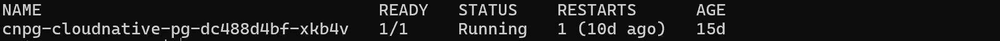
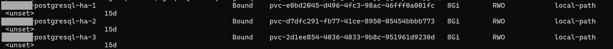

# 2026-k8s-postgresql-ha-cnpg


# 問題

因為 HA 需要，預防單點故障問題，在 K8s 容器上實作 PostgreSQL HA，這邊實作方式為在 k8s 建立CNPG 並支援多 Node 橫向擴展。

# 需求

主要目的是要讓 PostgreSQL 符合 HA 需求，避免單點故障問題。

1. 容器平台為 K8s。
2. Data 儲存方式為每個 Node 本地端 ( 每個 PostgreSQL instance 的 PVC 各自綁定在它的那一個節點上，儲存層本身完全沒有跨節點複寫 )

# 初步規劃 / 方向制定

目前單純的 PostgreSQL 無法支援 自動故障偵測、自動 Primary Pod 轉移、管理 Replica。
這些都需要靠人工或其他協調工具來完成。

但 CNPG 具有自動偵測、轉移等叢集所需能力，可以大幅減少我們手動處理的方式。

# 實作前規劃

K8s 物件分為兩類定義 :

- Helm Release 物件 : 透過 `helm install/upgrade` 建立，隨 Helm 被消滅/生成。
- kubectl apply 物件 ( Raw Manifests ) : 透過 `kubectl apply -f` 直接建立，完全不經過任何 Helm Release。


### CNPG 相關的 K8s 物件分兩類：

**kubectl apply 物件：**

- 自訂 Resource(CRD)：Cluster ( 下方第二步實作 )
- 內建物件：Secret ( 下方第二步實作 )

**Helm 管理物件 :**

- CNPG 的 Operator ( 下方第一步實作 )。
  以 Helm Release 建立一個 Pod 作為 Operator，並且這個物件預期是永久 live 的。

### 持久化資料儲存方式：

- 可以自行決定，這邊使用已經有的 local-path 本地路徑儲存。

# 功能實作

### 第一步 : 安裝 CNPG 的 Operator

這是 CNPG 的叢集管理員，所有的叢集層面自動操作，都由這個 Operator 處理，實際它的存在方式會是以 Helm Release 來建立一個 `cnpg-cloudnative-pg-*` Pod 來管理。

> 實際它的存在方式是透過這個 Helm Release 建立一個 Deployment，持續維持一個 `cnpg-cloudnative-pg-*` Pod 在背景運行，由這個 Pod 持續監看並管理所有 `Cluster` 物件。
>

Repo 內容版本定義檔案 : Chart.yaml

```jsx
apiVersion: v2
name: cnpg
description: CloudNativePG Operator for PostgreSQL HA
type: application
version: 0.1.0
appVersion: "0.28.2"

# helm repo add cnpg https://cloudnative-pg.github.io/charts
# helm dependency update .
dependencies:
  - name: cloudnative-pg
    version: 0.28.2
    repository: https://cloudnative-pg.github.io/charts
```

預設參數檔案 : values.yaml 留空即可。

執行下載操作 download-cnpg.sh :

這邊只需要做一次，需要在連網的地方執行，會自動把 Repo 下載到這個資料夾內。

```jsx
#!/bin/bash
set -euo pipefail
SCRIPT_DIR="$(cd "$(dirname "${BASH_SOURCE[0]}")" && pwd)"
cd "$SCRIPT_DIR"

helm dependency update .

echo ""
echo "[完成] CNPG 離線包下載完成"
ls charts/
```

執行檔 install-cnpg.sh : 每到一個新環境要做一次，不須連網，會把上個步驟下載好的 Repo 安裝到現在的 K8s 內 ( 預期是要永久 live )。

```jsx
#!/bin/bash
set -euo pipefail
SCRIPT_DIR="$(cd "$(dirname "${BASH_SOURCE[0]}")" && pwd)"
cd "$SCRIPT_DIR"

helm upgrade --install cnpg . \
  --namespace cnpg-system \
  --create-namespace \
  --wait \
  -f values.yaml

echo ""
echo "[完成] CNPG Operator 安裝-升級結束"
kubectl get pod -n cnpg-system
```

安裝完成後可以下指令看起來的 Operator Pod

執行

```jsx
kubectl get pod -n cnpg-system
```

可以看到 Pod 已被啟動

```jsx
NAME                                  READY   STATUS    RESTARTS     AGE
cnpg-cloudnative-pg-dc488d4bf-xkb4v   1/1     Running   1 (9d ago)   14d
```


### 第二步 : 匯入規則，建立 Cluster

建立並 apply Cluster 設定，剛剛的 cnpg Operator 會自動來這邊拿 Cluster 設定，建立出我們要叢集規則。

叢集規則設定檔 : cluster.yaml

( namespace、 name、database、owner、imageName 版本號 可自訂 )

```jsx
apiVersion: postgresql.cnpg.io/v1
kind: Cluster
metadata:
  name: postgresql-ha
  namespace: mynamespace
spec:
  instances: 3
  imageName: ghcr.io/cloudnative-pg/postgresql:18.4-standard-trixie
  storage:
    size: 8Gi
    storageClass: local-path
  superuserSecret:
    name: cnpg-superuser
  bootstrap:
    initdb:
      database: mydatabase
      owner: myowner
      secret:
        name: cnpg-app-user
  postgresql:
    parameters:
      max_connections: "200"
```

專門用來存放敏感資料 : secret.yaml

( namespace、username、password 請自行設定 )

```jsx
apiVersion: v1
kind: Secret
metadata:
  name: cnpg-superuser
  namespace: mynamespace
type: kubernetes.io/basic-auth
stringData:
  username: myname
  password: CHANGE_ME_PASSWORD
---
apiVersion: v1
kind: Secret
metadata:
  name: cnpg-app-user
  namespace: mynamespace
type: kubernetes.io/basic-auth
stringData:
  username: myname
  password: CHANGE_ME_PASSWORD
```

執行檔 apply-cnpg-cluster.sh : 每到一個新環境要做一次，將設定 apply 到 kubectl 中 ( 永久生效 )。

```jsx
#!/bin/bash
set -euo pipefail
SCRIPT_DIR="$(cd "$(dirname "${BASH_SOURCE[0]}")" && pwd)"
cd "$SCRIPT_DIR"

kubectl apply -f secret.yaml
kubectl apply -f cluster.yaml

echo ""
echo "[完成] CNPG Cluster 建立完成"
kubectl get cluster -n mynamespace
```

完成後可以下指令，來看的真正的 PostgreSQL Pod

```jsx
kubectl get pod -n mynamespace
```

會看到陸續生成的 Pod ( 數量依照剛剛 cluster 設定的 instances 數量 )

```jsx
postgresql-ha-1          1/1     Running   0          14m
postgresql-ha-2          1/1     Running   0          14m
postgresql-ha-3          1/1     Running   0          14m
```


執行以下指令，來看產生的 PVC

```jsx
kubectl get pvc -A
```

會看到 PVC，這些 PVC 會跟著 Cluster 的生命週期持續存在，即使 Pod 重啟、被重新排程到別的節點，資料也不會遺失。

```jsx
mynamespace        postgresql-ha-1  Bound RWO local-path 3m9s
mynamespace        postgresql-ha-2  Bound RWO local-path 2m47s
mynamespace        postgresql-ha-3  Bound RWO local-path 2m24s
```


### 第三步 : 使用 PostgreSQL 連線

應用程式可使用連線 URL 來做連線

```jsx
jdbc:postgresql://postgresql-ha-rw.mynamespace:5432/mydatabase
```